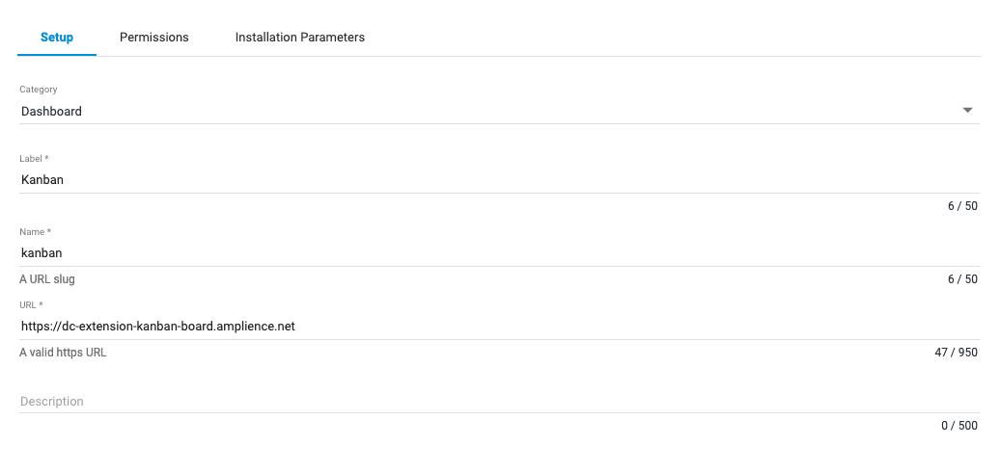
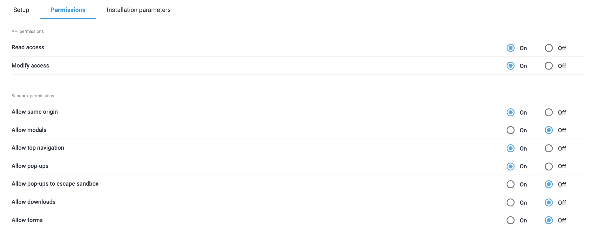

[](https://amplience.com/dynamic-content)

# dc-extension-kanban-board

## How to install Kanban dashboard extension

This extension needs to be [registered](https://amplience.com/docs/development/registeringextensions.html) in the Dynamic Content application (Developer -> Extensions) under the type of Dashboard.

The dashboard requires a specific configuration and the following example settings need to be defined:

### Setup



#### URL

You can use our deployed version of this extension (builds from the "production" branch) -

[https://kanban-board.extensions.content.amplience.net](https://kanban-board.extensions.content.amplience.net)

_As this is an open source project you're welcome to host your own "fork" of this project. You can use any standard static hosting service (Netlify, Amplify, Vercel, etc.) if you wish._

### Permissions



To use the application the following permissions must be enabled:

API permissions

- Read access
- Write access

Sandbox permissions

- Allow same origin
- Allow top navigation
- Allow pop-ups

### Installation parameters

```json
{
  "repositoryId": "<repository_id>",
  "statuses": [
    {
      "id": "<workflow_status_id>"
    },
    {
      "id": "<workflow_status_id>"
    },
    {
      "id": "<workflow_status_id>"
    }
  ]
}
```

## Dependency versions

The Kanban Board dashboard extension has been tested with the following versions:

- Node version `18.x`
- NPM version `9.x`

## How to build

Install the dependencies...

```bash
npm ci
```

To build a version of the app:

```bash
npm run build
```

## Running tests

```bash
npm run test
```

## How to run locally

```bash
npm run start
```

Opens http://localhost:8080 to view it in the browser.

## How to run locally over https

```bash
npm run start:secure
```

Same as `npm start` (runs the app in development mode).
Opens https://localhost:8080 to view it in the browser.

To run the mode you will need to [generate a ssl certificate (snowpack.key and snowpack.crt)](https://www.snowpack.dev/#https%2Fhttp2)

